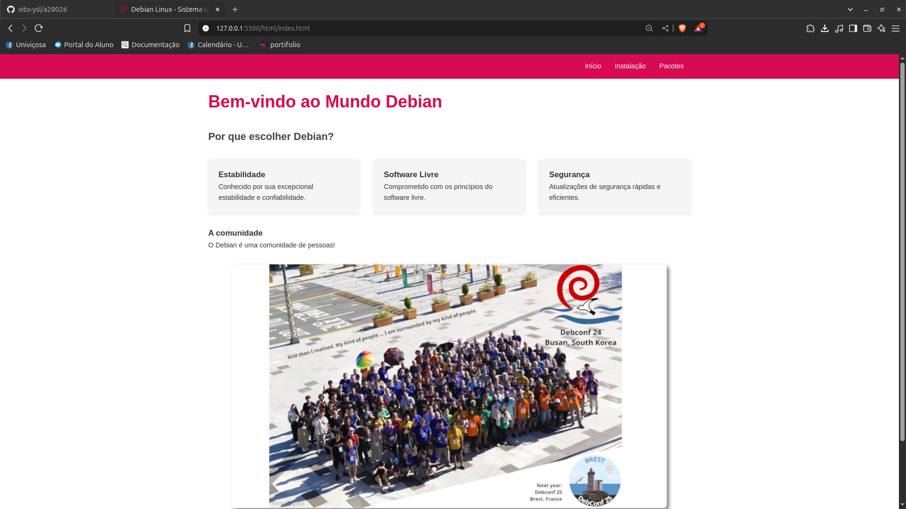
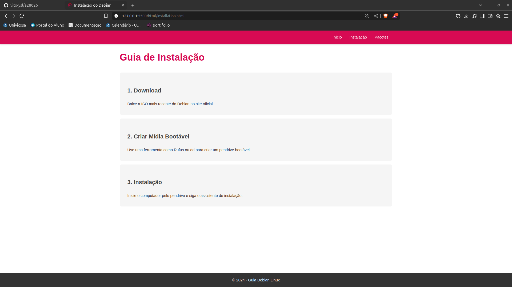
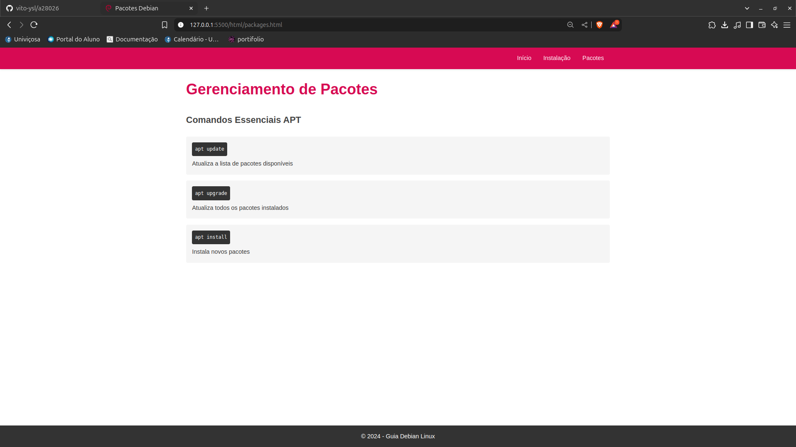

# Projeto Site Debian Linux - Introdução ao HTML/CSS

## 📋 Descrição
Este é um projeto educacional desenvolvido durante o primeiro período do curso, sob orientação do Professor Hermes. O projeto consiste em um site informativo sobre o sistema operacional Debian Linux, demonstrando conceitos fundamentais de HTML e CSS.

## 🚀 Funcionalidades
- Página inicial com informações sobre o Debian
- Guia de instalação passo a passo
- Seção sobre gerenciamento de pacotes
- Design responsivo para diferentes dispositivos
- Interface intuitiva e moderna

## 💻 Tecnologias Utilizadas
- HTML5
- CSS3
- Princípios de design responsivo

## 📁 Estrutura do Projeto
```
/a28026
├── assets/
│   └── styles.css
├── html/
│   ├── index.html
│   ├── installation.html
│   └── packages.html
├── imagens/
│   ├── favicon.ico
│   ├── bg_1024x768.png
│   └── debconf24_group_photo.jpg
└── README.md
```

## 🎨 Características do Design
- Cores principais: Vermelho Debian (#d70a53)
- Layout responsivo
- Componentes com animações suaves
- Sombras e efeitos visuais sutis

## 📚 Aprendizados
- Estruturação semântica HTML
- Estilização com CSS
- Flexbox e Grid para layouts
- Media queries para responsividade
- Boas práticas de desenvolvimento web

## 🔧 Como Executar
1. Clone o repositório
2. Abra o arquivo `html/index.html` em um navegador web
3. Navegue pelo site usando o menu de navegação

## 👨‍🏫 Professor
- **Hermes Siqueira** - _Disciplina de Desenvolvimento Web_

## 📝 Licença
Este projeto é de código aberto e foi desenvolvido para fins educacionais.

---

Desenvolvido com 💜 como parte do currículo do primeiro período.

## 📸 Screenshots


